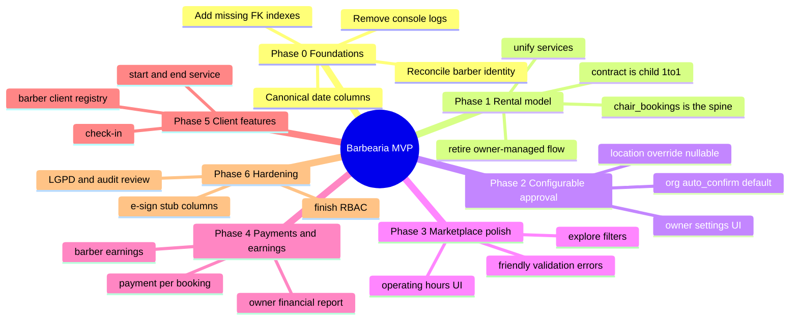
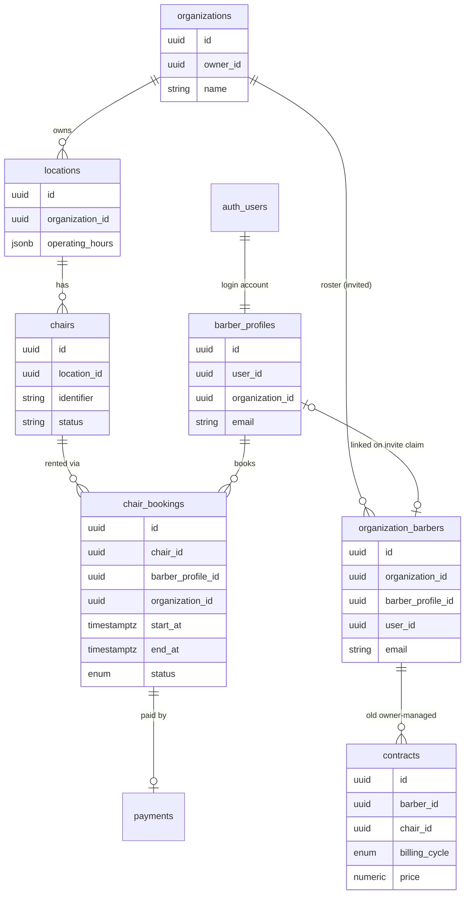
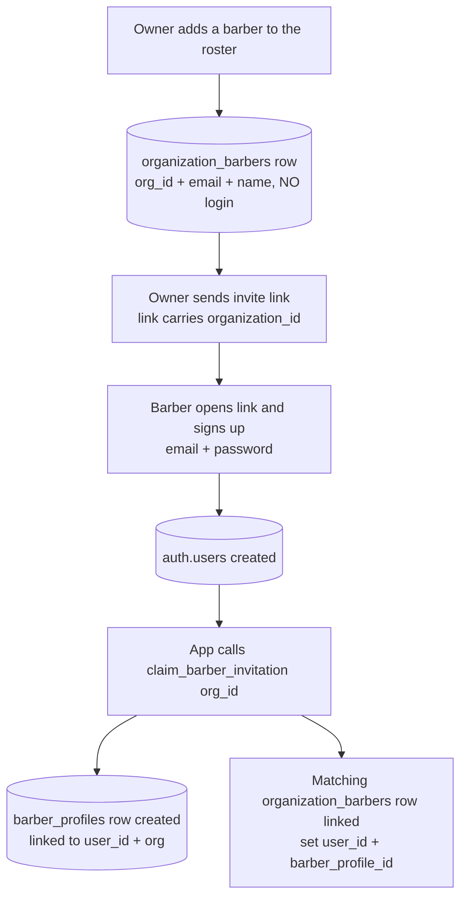
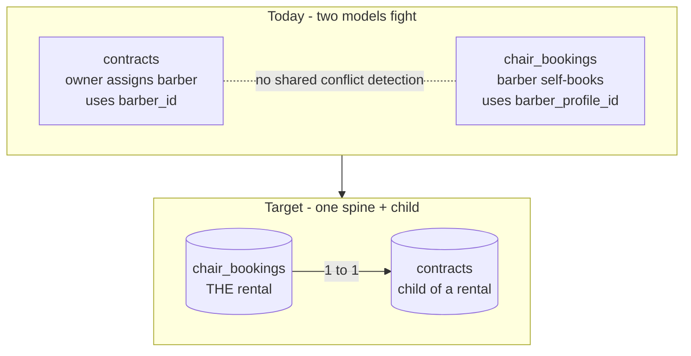
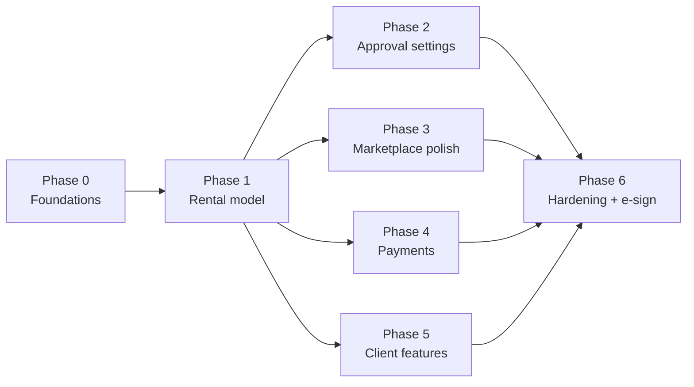

# 🗺️ Barbearia — Architecture Analysis & Development Roadmap

> **Audience:** the intern implementing the features (with AI assistance).
> **Author role:** Product Manager (planning, not coding).
> **Last updated:** 2026-06-17

This document explains **how the system works today**, the **product decisions** that have been locked in, and a **phased roadmap** to finish a polished MVP. Diagrams are written in [Mermaid](https://mermaid.js.org/) and render automatically on GitHub.

---

## 1. Product in one sentence

A **multi-tenant marketplace** where barbershop owners list **chairs** across their **locations**, and independent **barbers** browse and **rent** those chairs — each rental producing a **contract**.

### Locked product decisions (2026-06-17)

| Topic | Decision |
|-------|----------|
| **Tenancy** | True multi-tenant **marketplace** — many owners, barbers rent across organizations. |
| **Rental ↔ contract** | Chair **rental is the source of truth**. Each rental has **one contract (1:1)**. Recurring contracts deferred. |
| **Booking flow** | Barber **self-service, instant confirmation by default**, but **configurable** (org-level default → location-level override). |
| **Barber onboarding** | Owner creates a roster entry (no login) → sends **invite link** → barber **signs up** and the account is linked via `claim_barber_invitation()`. Keep this flow as designed. |
| **Money / payouts** | Each owner/organization handles money **off-platform** for now. No cross-org payout in this MVP. |
| **Naming** | Rename the `barbers` table → **`organization_barbers`** (it's an org-scoped roster, not "all barbers"). Documented Phase 0 task. |
| **E-signature** | Dropbox Sign planned **near production** — design for it, don't build it yet. |

---

## 2. Roadmap at a glance (mindmap)

---

## 3. How the system works today

### 3.1 Tech stack

- **Frontend:** React 18 + TypeScript + Vite, Tailwind + shadcn/ui, React Router, React Query (underused).
- **Backend:** Supabase (PostgreSQL + Auth + Row Level Security). No custom API server — the frontend talks to Supabase directly, with a thin `src/services/*.ts` query layer.
- **Two apps in one codebase:** Owner/Admin portal (`/*`) and Barber portal (`/barber/*`).

### 3.2 Core data model (today)

### 3.3 ⭐ `barbers` (→ `organization_barbers`) vs `barber_profiles` (important)

These are **two different things**, and conflating them is the project's biggest source of confusion.

> **Naming decision:** the `barbers` table will be renamed to **`organization_barbers`**, because it does **not** hold "all barbers" — it holds one organization's **roster** of barbers (invited, then activated). The name `barbers` misleads you into expecting a global list. See Phase 0.

**The real onboarding flow (as designed — keep it):**

| | `organization_barbers` (today: `barbers`) | `barber_profiles` |
|---|---|---|
| **Created by** | The owner (adds someone to their roster) | The barber, via the invite-claim on sign-up |
| **Has login/password?** | ❌ No | ✅ Yes (linked to `auth.users`) |
| **Scope** | One row **per organization** the barber belongs to | One **global** account per person |
| **Used by** | `contracts.barber_id` (legacy owner-managed) | `chair_bookings.barber_profile_id` (self-service) |
| **Meaning** | "A barber enrolled in my shop (invited / active)" | "An actual platform user who can log in and rent" |

**How they link:** the owner pre-registers the roster row; when the barber signs up through the invite link, `claim_barber_invitation()` creates the `barber_profiles` account and stamps `user_id` + `barber_profile_id` onto the matching roster row (matched by organization + email).

**Marketplace implication:** the real actor is `barber_profiles` (one person, rents across many orgs). `organization_barbers` is the **per-org enrollment/invite** record — keep it exactly as designed, but it must **not** be required to *rent a chair* (renting is driven by `barber_profiles`). This is why **Phase 1 moves `contracts` onto `barber_profile_id`.**

### 3.4 The central problem: two competing rental models

**What's already good** (don't rebuild these):
- GIST exclusion constraints prevent overlapping bookings **per chair** and **per barber**.
- A 4-hour minimum rental is enforced at the DB.
- `locations.operating_hours` (JSONB) + a validation function + a trigger already reject out-of-hours bookings. The **UI to manage hours is what's missing**, not the enforcement.

---

## 4. Phased roadmap

> Phases 0 and 1 are the **critical path** — do them first and carefully. Everything after is more mechanical and can be parallelized.

### Phase 0 — Foundations & cleanup
**Goal:** remove ambiguities that make every later task risky.

- [ ] Write a short `ARCHITECTURE.md`: *a barber = `barber_profiles`; a rental = `chair_bookings`; a contract = child of a rental.*
- [ ] Decide `barber_profiles` is the canonical barber; treat `organization_barbers` as the per-org invite/roster.
- [ ] **Rename `barbers` → `organization_barbers`** (one migration). Rename the **table only**, plus its RLS policies, the `claim_barber_invitation()` function, and frontend references to the table name. **Do NOT rework `contracts.barber_id` here** — Phase 1 deletes that column, so touching it now is wasted effort and a double review. Single, isolated PR.
- [ ] **Confirm `barber_profiles.organization_id` is `NULL`-able** (`NULL` = global self-signup barber, set = invited + claimed by an org). Renting across orgs uses `chair_bookings.organization_id`, **never** the profile's own org. If the live column is `NOT NULL`, ship a migration to make it nullable — global barbers are blocked otherwise.
- [ ] Standardize on `start_at` / `end_at` (timestamptz); deprecate `contracts.start_date` / `end_date`.
- [ ] Remove production `console.log`s (`useAuth.tsx`, `useOrganization.tsx`, etc.).
- [ ] Add the 4 missing FK indexes (script already in `PROJECT_STATUS.md`).

**Acceptance:**
- `ARCHITECTURE.md` exists.
- `tsc` reports **zero errors**; **no `console.log`** remains in `src/`.
- The 4 FK indexes exist (verify via `pg_indexes` query).
- `barber_profiles.organization_id` is nullable; a barber with `organization_id = NULL` can be created.
- Table renamed; **no `contracts.barber_id` change in this PR.**

**How to test:** run the migration on a Supabase **branch**, seed one global barber (`organization_id = NULL`) and one invited barber, confirm both insert; run `tsc` and a `grep` for `console.log` in `src/`.

### Phase 1 — Consolidate the rental model (the core decision)
**Goal:** `chair_bookings` is the rental spine; each rental has exactly one contract.

> **No data to migrate.** The database has **no real production data yet**, so there is **no backfill**. The legacy owner-managed contracts (no `chair_bookings` parent) are simply **deleted**; `contracts` is rebuilt clean as a child of bookings. This removes the riskiest migration step entirely.

- [ ] Migration: **delete legacy `contracts` rows** (owner-managed, no booking parent). Then drop the now-unused `contracts.barber_id` column.
- [ ] Migration: add `contracts.booking_id uuid UNIQUE NOT NULL REFERENCES chair_bookings(id)`.
- [ ] Migration: add `contracts.barber_profile_id` (sourced from the parent booking, no backfill needed).
- [ ] Triggers (see lifecycle table below): on booking **status → confirmed**, create the contract; on **status → cancelled/rejected**, void it.
- [ ] Retire the owner-assigns-contract UI (`ContractsPage.tsx`) or make it a read-only view derived from bookings.
- [ ] Collapse `contracts.ts` / `barberBookings.ts` / `chairBookings.ts` toward one bookings service.
- [ ] **RLS in the same PR:** add/update policies for the new `contracts.booking_id` / `barber_profile_id` columns and any cross-org marketplace read paths (do not defer security to Phase 6).

**Contract lifecycle (booking status → contract):**

| Booking status | Contract row | Contract state |
|---|---|---|
| pending | none | — (no contract until confirmed) |
| confirmed | exists | active |
| cancelled / rejected | exists (if was confirmed) | **voided** (soft — row kept for audit / future e-sign, never hard-deleted) |
| completed | exists | fulfilled |

> The create trigger fires on the **status transition → confirmed**, which covers **both** owner-approval and instant-confirm. The void trigger fires on the transition **→ cancelled/rejected**. Contracts are soft-voided (status flip), never deleted — they are legal records.

**Acceptance:**
- Confirming a booking yields **exactly one** contract (`booking_id` set, unique).
- A pending booking has **no** contract; approving it then creates one.
- Cancelling/rejecting a confirmed booking flips its contract to `voided` (row still present).
- No code writes a "rental" that isn't a `chair_bookings` row; `MyBookings` and `MyContracts` read one source.

**How to test:** on a Supabase branch — create a booking under an **instant-confirm** org (expect 1 contract), create one under a **pending** org (expect 0, then approve → 1), cancel a confirmed one (expect contract `voided`, row present). Verify RLS: a barber sees only their own contracts.

### Phase 2 — Configurable approval (org → location)
**Goal:** instant-confirm by default, overridable.

- [ ] `organizations.auto_confirm_bookings boolean NOT NULL DEFAULT true`.
- [ ] `locations.auto_confirm_bookings boolean NULL` (`NULL` = inherit).
- [ ] Resolution rule: `COALESCE(location.setting, org.setting)` → `confirmed` or `pending`.
- [ ] Owner UI: org toggle + per-location override (Inherit / On / Off).
- [ ] **RLS in the same PR:** only an org owner may write its `auto_confirm_bookings` settings.

> **PM note:** we deliberately use the simple `COALESCE` inheritance now and defer a full settings-inheritance engine until there are 5+ inheritable settings. The stored data stays compatible.

**Acceptance:** org toggle changes new-booking status; a location override beats the org default.

**How to test:** org `auto_confirm = true` → new booking is `confirmed` (and gets a contract, per Phase 1); set org `false` → new booking is `pending`; set one location to `On` while org is `false` → that location confirms instantly, others stay pending.

### Phase 3 — Marketplace & operating-hours polish
- [ ] Operating-hours CRUD UI for owners (enforcement already exists in DB).
- [ ] Explore page: filter by city / location / date / time using `vw_public_chair_explore`.
- [ ] Friendly error messages for hours / overlap / 4-hour-minimum violations.

**Acceptance:** owner sets Sunday closed → barber cannot book Sunday, with a clear message; explore filters return correct availability.

### Phase 4 — Payments & earnings tied to rentals
> **Scope note:** money is handled **off-platform** for this MVP. This phase is **record-keeping only** — no payment gateway, no cross-org payout. We track *what is owed / was paid* so owners and barbers have an accurate ledger; settlement happens outside the app.

- [ ] **Discovery first:** document what `payment_system_v2` actually is (tables, columns, what writes to it, is it used) before changing anything. Output a 1-paragraph note; only then decide keep / merge / drop.
- [ ] Ensure `payments.booking_id` is the canonical link; reconcile `payment_system_v2` per the discovery outcome.
- [ ] Barber earnings + owner financial report read from booking → payment.
- [ ] Payment status is a manual/recorded field (e.g. `pending` / `paid`), not a gateway callback.

**Acceptance:** each confirmed booking has a payment record; earnings and reports reconcile from booking → payment.

### Phase 5 — Barber client-facing features (F010–F012)
- [ ] Client check-in at the location.
- [ ] Start / end of service.
- [ ] Barber's own client registry + history.

*Self-contained; can run in parallel once Phase 1 lands.*

### Phase 6 — Production hardening + e-sign prep
- [ ] Finish RBAC (F003: manager, reception, granular permissions).
- [ ] LGPD / audit-log review.
- [ ] Add `contracts.esign_status` / `esign_envelope_id` stub columns (no integration yet).

---

## 5. Dependency flow

---

## 6. Resolved decisions (was: open questions)

1. ✅ **Keep the roster table.** `organization_barbers` (renamed from `barbers`) stays as designed: owner creates a roster entry → sends invite link → barber signs up and is linked via `claim_barber_invitation()`. Not replaced.
2. ✅ **Money off-platform.** Each owner/organization settles money outside the app for this MVP. No cross-org payout. Phase 4 is ledger/record-keeping only.
3. ✅ **Docs in both languages.** English (`ROADMAP.md`) is the source; a Portuguese (pt-BR) copy is maintained at `ROADMAP.pt-BR.md` for the intern.
