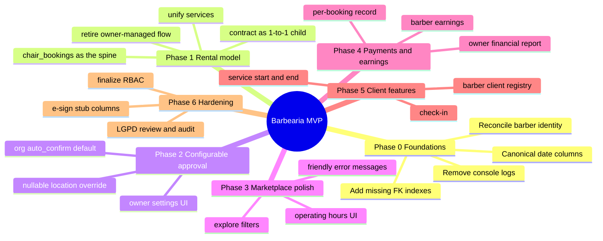
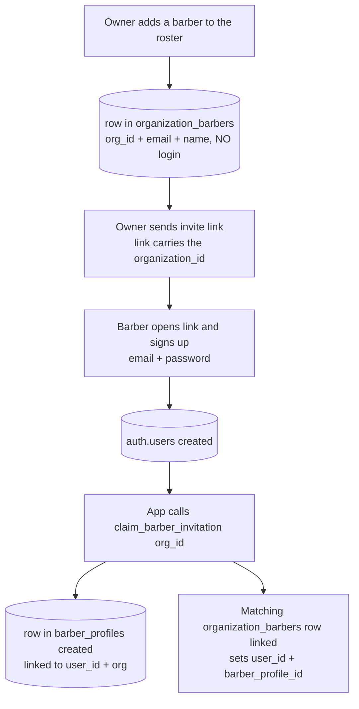
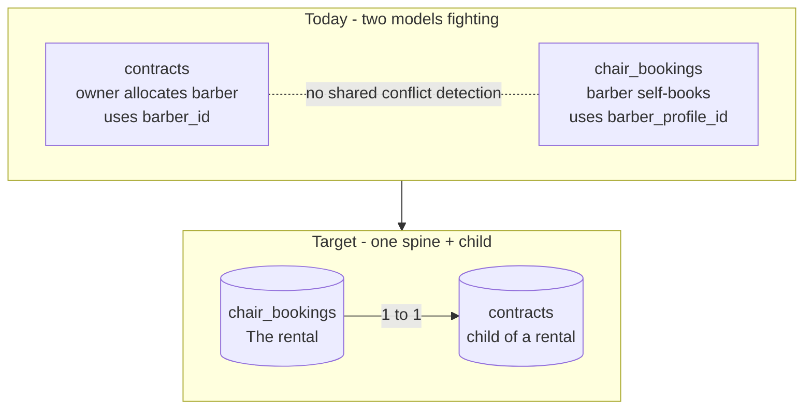
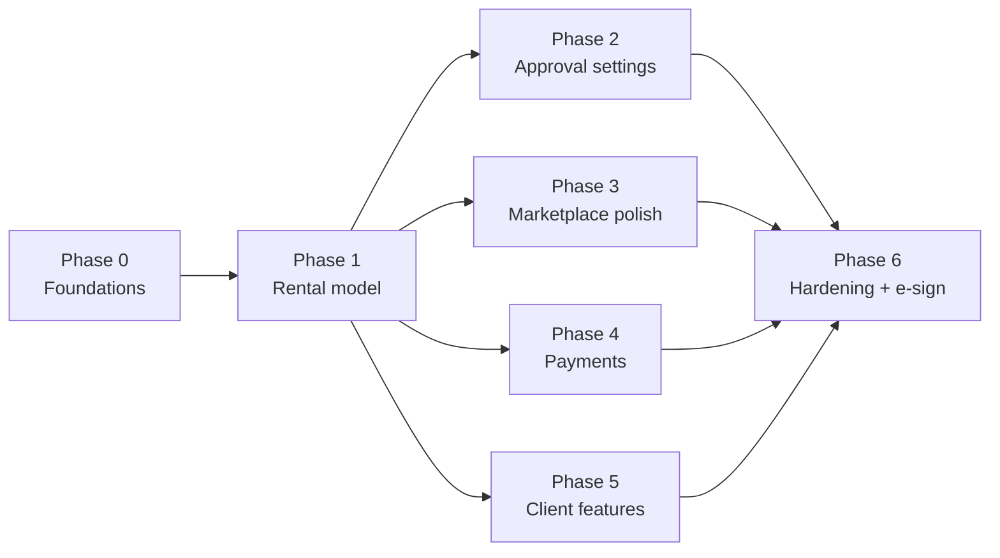

# 🗺️ Barbearia — Architecture Analysis & Development Roadmap

> **Audience:** The intern implementing the features (with AI support).
> **Author role:** Product Manager (planning, not coding).
> **Last updated:** 17/06/2026

This document explains **how the system works today**, the **product decisions** already closed, and a **phased roadmap** to complete a polished MVP. Diagrams use [Mermaid](https://mermaid.js.org/) and render automatically on GitHub.

> 🇧🇷 Portuguese version (pt-BR): [`ROADMAP.pt-BR.md`](ROADMAP.pt-BR.md).

---

## 1. The product in one sentence

A **multi-tenant marketplace** where barbershop owners list **chairs** at their **locations**, and **independent barbers** browse and **rent** those chairs — each rental generating a **contract**.

### Closed product decisions (17/06/2026)

| Topic | Decision |
|-------|----------|
| **Tenancy** | True multi-tenant **marketplace** — multiple owners, barbers rent across different organizations. |
| **Rental ↔ contract** | The **chair rental is the source of truth**. Each rental has **one contract (1:1)**. Recurring contracts come later. |
| **Booking flow** | Barber **self-service, instant confirmation by default**, but **configurable** (org-level default → location-level override). |
| **Barber onboarding** | Owner creates a roster entry (no login) → sends **invite link** → barber **signs up** and account is linked via `claim_barber_invitation()`. Keep this flow as designed. |
| **Money / payouts** | Each owner/organization handles money **off-platform** for now. No cross-org payouts in this MVP. |
| **Naming** | Rename table `barbers` → **`organization_barbers`** (it's a per-org roster, not "all barbers"). Task documented in Phase 0. |
| **E-signature** | Dropbox Sign planned **near production** — design with it in mind, but don't build it now. |

---

## 2. Roadmap at a glance (mind map)

---

## 3. How the system works today

### 3.1 Tech stack

- **Frontend:** React 18 + TypeScript + Vite, Tailwind + shadcn/ui, React Router, React Query (underutilized).
- **Backend:** Supabase (PostgreSQL + Auth + Row Level Security). No custom API — frontend talks directly to Supabase, with a thin query layer in `src/services/*.ts`.
- **Two apps in the same codebase:** Owner/Admin portal (`/*`) and Barber portal (`/barber/*`).

### 3.2 Core data model (today)

### 3.3 ⭐ `barbers` (→ `organization_barbers`) vs `barber_profiles` (important)

These are **two different things**, and confusing them is the biggest source of confusion in the project.

> **Naming decision:** the `barbers` table will be renamed to **`organization_barbers`**, because it does **not** store "all barbers" — it stores the **roster** of barbers for an organization (invited, and later activated). The name `barbers` is misleading, suggesting a global list. See Phase 0.

**The actual onboarding flow (as designed — keep it):**

| | `organization_barbers` (today: `barbers`) | `barber_profiles` |
|---|---|---|
| **Created by** | Owner (adds someone to roster) | Barber, via invite signup |
| **Has login/password?** | ❌ No | ✅ Yes (linked to `auth.users`) |
| **Scope** | One row **per organization** the barber belongs to | One **global** account per person |
| **Used by** | `contracts.barber_id` (legacy owner-managed) | `chair_bookings.barber_profile_id` (self-service) |
| **Meaning** | "A barber registered at my barbershop (invited / active)" | "A real platform user who can log in and rent" |

**How they connect:** the owner pre-creates the roster row; when the barber signs up via the invite link, `claim_barber_invitation()` creates the `barber_profiles` record and writes `user_id` + `barber_profile_id` into the matching roster row (matched by org + email).

**Marketplace implication:** the real actor is `barber_profiles` (one person, rents across multiple orgs). `organization_barbers` is the **enrollment/invite record per org** — keep it exactly as designed, but it should **not** be required to *rent a chair* (rentals are driven by `barber_profiles`). That's why **Phase 1 moves `contracts` to `barber_profile_id`.**

### 3.4 The core problem: two competing rental models

**What's already good** (don't rebuild):
- GIST exclusion constraints prevent overlapping bookings **per chair** and **per barber**.
- A 4-hour minimum rental is enforced at the database level.
- `locations.operating_hours` (JSONB) + validation function + trigger already reject bookings outside operating hours. What's **missing is the UI to manage hours**, not the validation.

---

## 4. Phased roadmap

> Phases 0 and 1 are the **critical path** — do them first and carefully. The rest is more mechanical and can be parallelized.

### Phase 0 — Foundations & cleanup
**Goal:** remove ambiguities that make every future task risky.

- [x] Write a short `ARCHITECTURE.md`: *one barber = `barber_profiles`; one rental = `chair_bookings`; one contract = child of a rental.* (Done)
- [x] Establish `barber_profiles` as the canonical barber; treat `organization_barbers` as the per-org roster/invite record. (Done)
- [x] **Rename `barbers` → `organization_barbers`** (one migration). (Done)
- [x] **Confirm `barber_profiles.organization_id` accepts `NULL`**. (Done)
- [x] Standardize on `start_at` / `end_at` (timestamptz); deprecate `contracts.start_date` / `end_date`. (Done)
- [x] Remove production `console.log`s (`useAuth.tsx`, `useOrganization.tsx`, etc.). (Done)
- [x] Add the 4 missing FK indexes (script already in `PROJECT_STATUS.md`). (Done)

**Acceptance:**
- `ARCHITECTURE.md` exists.
- `tsc` reports **zero errors**; **no `console.log`** remaining in `src/`.
- The 4 FK indexes exist (verify via `pg_indexes` query).
- `barber_profiles.organization_id` is nullable; a barber with `organization_id = NULL` can be created.
- Table renamed; **no changes to `contracts.barber_id` in this PR.**

**How to test:** run the migration on a Supabase **branch**, seed a global barber (`organization_id = NULL`) and an invited barber, confirm both insert; run `tsc` and `grep` for `console.log` in `src/`.

### Phase 1 — Consolidate the rental model (the central decision)
**Goal:** `chair_bookings` is the rental spine; each rental has exactly one contract.

> **No data to migrate.** The database **has no real production data yet**, so **no backfill**. Legacy owner-managed contracts (without a parent booking in `chair_bookings`) are simply **deleted**; `contracts` is rebuilt clean as a child of bookings. This eliminates the riskiest migration step.

- [x] Migration: **delete legacy `contracts` rows** (owner-managed, no parent booking). Then drop the now-unused `contracts.barber_id` column. (Done)
- [x] Migration: add `contracts.booking_id uuid UNIQUE NOT NULL REFERENCES chair_bookings(id)`. (Done)
- [x] Migration: add `contracts.barber_profile_id` (sourced from the parent booking, no backfill needed). (Done)
- [x] Triggers (see lifecycle table below): on **booking status → confirmed**, create the contract; on **status → cancelled/rejected**, void it. (Done)
- [x] Retire the "owner assigns contract" UI (`ContractsPage.tsx`) or convert it to a read-only view derived from bookings. (Done)
- [x] Unify `contracts.ts` / `barberBookings.ts` / `chairBookings.ts` into a single booking service. (Done)
- [x] **RLS in the same PR:** add/update policies for the new `contracts.booking_id` / `barber_profile_id` columns and any cross-org marketplace read paths (don't defer security to Phase 6). (Done)

**Contract lifecycle (booking status → contract):**

| Booking status | Contract row | Contract state |
|---|---|---|
| pending | none | — (no contract until confirmed) |
| confirmed | exists | active |
| cancelled / rejected | exists (if previously confirmed) | **voided** (soft void — row kept for audit / future e-sign, never actually deleted) |
| completed | exists | fulfilled |

> The creation trigger fires on **status transition → confirmed**, which covers **both** owner approval **and** instant confirmation. The void trigger fires on **→ cancelled/rejected**. Contracts are soft-voided (status change), never deleted — they are legal records.

**Acceptance:**
- Confirming a booking creates **exactly one** contract (`booking_id` filled, unique).
- A pending booking has **no** contract; approving it then creates one.
- Cancelling/rejecting a confirmed booking changes its contract to `voided` (row still present).
- No code writes a "rental" that isn't a row in `chair_bookings`; `MyBookings` and `MyContracts` read from the same source.

**How to test:** on a Supabase branch — create a booking under an **instant-confirm** org (expect 1 contract), create one under a **pending** org (expect 0, then approve → 1), cancel a confirmed one (expect `voided` contract, row present). Check RLS: a barber sees only their own contracts.

### Phase 2 — Configurable approval (org → location)
**Goal:** instant confirmation by default, with override capability.

- [x] `organizations.auto_confirm_bookings boolean NOT NULL DEFAULT true`. (Done)
- [x] `locations.auto_confirm_bookings boolean NULL` (`NULL` = inherit). (Done)
- [x] Resolution rule: `COALESCE(location.setting, org.setting)` → `confirmed` or `pending`. (Done)
- [x] Owner UI: toggle at the org level + per-location override (Inherit / On / Off). (Done)
- [x] **RLS in the same PR:** only the org owner can write `auto_confirm_bookings` settings for their org. (Done)

> **PM note:** we intentionally use simple `COALESCE` inheritance now and defer a full settings inheritance engine until there are 5+ inheritable settings. The stored data remains compatible.

**Acceptance:** the org toggle changes the status of new bookings; a location override takes precedence over the org default.

**How to test:** org `auto_confirm = true` → new booking becomes `confirmed` (and gets a contract, per Phase 1); org `false` → new booking stays `pending`; a location with `On` while org is `false` → that location confirms instantly, others stay pending.

### Phase 3 — Marketplace polish & operating hours
- [x] Owner CRUD UI for operating hours (validation already exists in the database). (Done)
- [x] Explore page: filter by city / location / date / time using `vw_public_chair_explore`. (Done)
- [x] Friendly error messages for hours violations / overlap / 4-hour minimum. (Done)

**Acceptance:** owner marks Sunday as closed → barber cannot book on Sunday, with a clear message; Explore filters return correct availability.

### Phase 4 — Payments & earnings tied to rentals
> **Scope note:** money is handled **off-platform** in this MVP. This phase is **record-keeping only** — no payment gateway, no cross-org payouts. We record *what is owed / was paid* so owners and barbers have an accurate ledger; settlement happens outside the app.

- [x] **Discovery first:** document what `payment_system_v2` actually is (tables, columns, what writes to it, whether it's in use) before changing anything. Produce a 1-paragraph note; only then decide to keep / merge / discard. (Done)
- [x] Ensure `payments.booking_id` is the canonical link; reconcile `payment_system_v2` based on discovery findings. (Done)
- [x] Barber earnings + owner financial report read from booking → payment. (Done)
- [x] Payment status is a manual/recorded field (e.g., `pending` / `paid`), not a gateway callback. (Done)

**Acceptance:** each confirmed booking has a payment record; earnings and reports trace from booking → payment.

### Phase 5 — Barber's client-facing features (F010–F012)
- [x] Client check-in at the location. (Done)
- [x] Service start / end. (Done)
- [x] Barber's own client registry + history. (Done)

*Self-contained; can run in parallel once Phase 1 is done.*

### Phase 6 — Production hardening + e-sign prep
- [x] Finalize RBAC (F003: manager role with granular permissions per location). (Done)
- [x] LGPD consent banner + `consent_records` table + `audit_logs` table + `AuditLogPage`. (Done)
- [x] Add stub columns `contracts.esign_status` / `esign_envelope_id` (no integration yet). (Done)

---

## 5. Dependency flow

---

## 6. Resolved decisions (previously: open questions)

1. ✅ **Keep the roster table.** `organization_barbers` (renamed from `barbers`) stays as designed: owner creates roster row → sends invite link → barber signs up and is linked via `claim_barber_invitation()`. Will not be replaced.
2. ✅ **Money off-platform.** Each owner/organization settles money outside the app in this MVP. No cross-org payouts. Phase 4 is ledger/record only.
3. ✅ **Docs in both languages.** English (`ROADMAP.md`) is the source; a pt-BR copy is maintained in `ROADMAP.pt-BR.md` for the intern.
